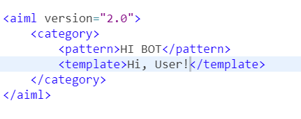

AIML基本标签
==========
在这一小节中，我们会介绍四个AIML的基本标签，它们分别是`<aiml>、<category>、<pattern>、<template>`。

 ## \<aiml> 标签

`<aiml>` 标签位于AIML文档的开始和结束。它的属性包含版本和编码信息。作为强制性要求，`<aiml>` 标记必须至少包含一个 `<category>` 标记。我们可以创建多个AIML文件，其中每个AIML文件都包含一个 `<aiml>` 标签。  

在Pandorabots里我们每次新建一个aiml文件，系统都会自动为我们生成 `<aiml>` 标签。  

## \<category> 标签  
`<category>`标签是我们创建的机器人的基本知识单元，里面包括**用户的输入内容**和**bot的响应内容**。标签内必须包含两个标签：`<pattern>和<template>`。

## \<pattern> 标签
`<pattern>` 表示**用户的输入**。它是`<category>`标记中的第一个标记。`<pattern>`标记可以包含通配符以匹配多个句子,即多种用户输入。  
AIML不区分大小写。如果用户输入Hello Alice，hello alice，HELLO ALICE等，则所有输入均有效，为了使大小写的输入均能匹配到，我们一般会把 `<pattern>` 标签里的内容全部大写，如：  
`<pattern>HELLO BOT</pattern>`。  
**注意**：`<pattern>`标签内不能出现标点符号。

## \<template> 标签
`<template>` 标签表示**bot对用户的响应**。它是<category>标记内的第二个标记。 在这个标签内还可以增加其他标签来实现更为复杂的对话逻辑。其他标签我们会在后面的小节中涉及到。

## 示例
在我们刚才创建好的hello.aiml里加入如下代码：
  
点击界面右下角橘色背景按钮进行测试，输入`hi bot` ,得到bot的响应 `Hi, User!`  
  

## 小结
在这一节中，我们介绍了AIML语言中四个最基本的标签，并用这些标签搭建了一个聊天机器人中的“Hello World”。在后面的小节中，我们将会继续介绍AIML的标签，并用这些标签来实现更加复杂的聊天机器人。大家开始转战下一章吧！  

