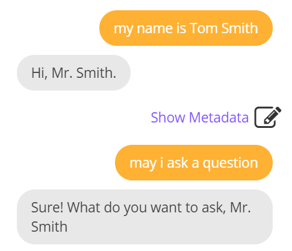

\<set>和\<get>标签
================
`<set>` 和 `<get>`标记用于在AIML中设置变量和使用变量。变量可以是预定义的变量，也可以是编写者创建的变量。  

比如，我想实现下面的对话：  
User：My name is Tom Smith.  
Bot：Hi, Mr. Smith.   
User：May I ask a question?  
Bot：Sure! What do you want to ask, Mr. Smith?  

bot在第二次响应的时候需要知道用户的名字信息，但是这是两个category，要如何共享信息呢？这时就用到了 `<set>` 和 `<get>` 标签。请看下面代码：  

  

`<set>` 负责设置名称属性， `<get>` 标签负责获取名称属性的属性值。  

测试：  

  

这一小节我们学习了如何设置和获取变量，不知道您有没有练习起来呢？加油，让我们继续学习下一章吧！  

