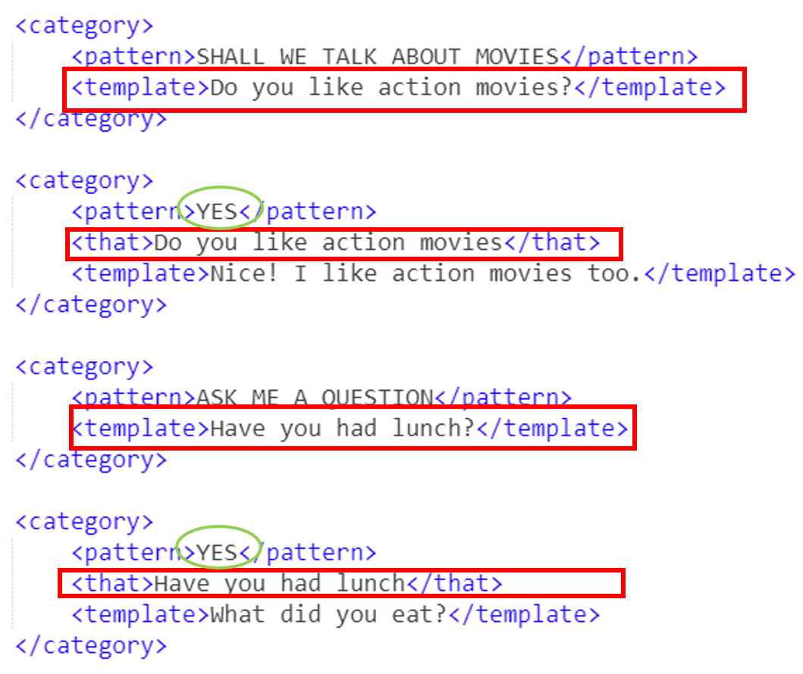
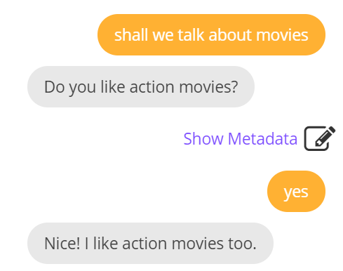
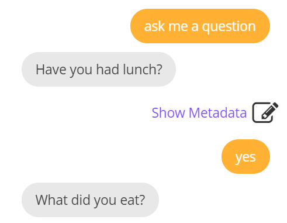

\<that>标签
============
<that>标签在AIML中用于根据上下文进行响应。  

比如，我们想要实现以下对话：  
User：Shall we talk about movies?  
Bot：Sure! Do you like action movies?  
User：Yes.  
Bot：I like action movies, too.  

User：Ask me a question.  
Bot：Have you had lunch?  
User：Yes.  
Bot：What did you eat?  

这两个对话是要写在同一个aiml里的，在这两个场景下，用户都回答了 “Yes”，那么我们的bot要如何知道回复哪个呢？这时就需要用到 `<that>` 标签。请看下面的代码:  

  

可以看到 `<that>` 标签里面的内容就是一个对话下的上一个template中的内容。细心的同学可能会发现，`<that>` 标签和 `<pattern>` 标签一样，里面**不能出现标点符号**。  

测试：  

  

  

这一节我们学到了用 `<that>` 标签将两个category的内容联系了起来，在AIML中还有一个标签与上下文有关，如果您感兴趣，就继续学习下一节吧！！  

