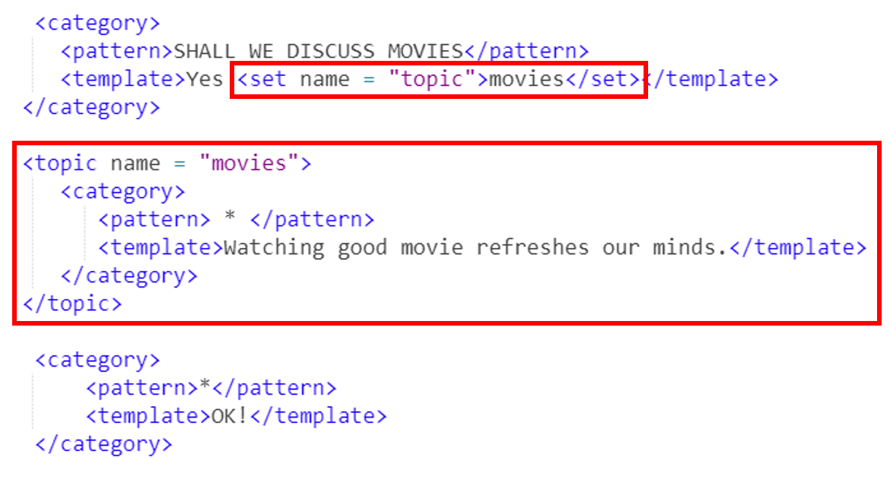
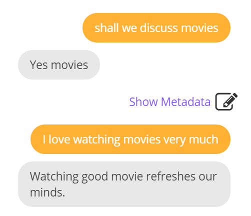

\<topic>标签
=============
上一节我们了解了 `<that>` 标签能够将上下文联系起来，但是它的作用很有限，如果遇到上一个对话中的 `<template>` 中的内容一模一样这种情况，这个标签就不起作用了。这时我们就需要 `<topic>` 标签。  

`<topic>` 标签在AIML中用于存储上下文，以便以后可以基于该上下文进行对话。通常，在 “是/否” 类型对话中使用该标签。它可以帮助AIML搜索在主题上下文内编写的category。  

比如，我们要实现以下对话：
User: Shall we discuss movies?  
bot: Yes movies.  
User: Comedy movies are nice to watch.  
bot: Watching good movie refreshes our minds.

这个对话看似简单，但是如果有另一个对话，bot也回复的是“Yes movies.”, 那要怎么做呢？请看下面的代码：  

  

从上面的代码中可以看出，`<topic>` 标签把两个对话联系了起来。在`<topic>` 标签外面的同样的 `<pattern>` 内容就不会被匹配到。下面看一下测试结果：  

  

这一小节和上一小节讲的两个标签较之前的标签较为复杂，同学们可以多练多试多比较。如果还有什么疑问，可以及时联系笔者，邮箱为：catwts@pku.edu.cn 