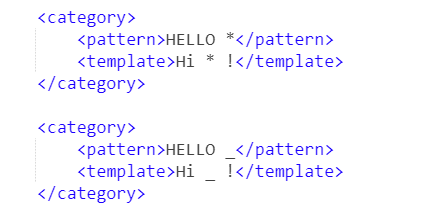
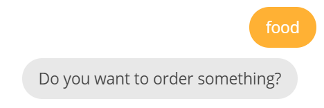

AIML通配符
===============
通配符是文本值中代替未知字符的特殊字符。在AIML中，通配符还可以用来捕捉用户输入。AIML中有四种通配符，分别是“ * ”、“_”、“^”、“#”，需要注意的是，通配符只能用来匹配单词，而不能匹配词的字符。以上四种通配符所包含的含义和优先级各有不同，下面我们就来看一下他们的具体应用：  
## 通配符 “ * ”
“ * ” 能够匹配、捕捉一个或多个用户输入的词。比如 `<pattern>HELLO *</pattern>` 能够匹配：
1. Hello there!
2. Hello my friend

## 通配符 “_”
和上面讲的 “ * ” 通配符一样，“_”同样能够匹配、捕捉一个或多个用户输入的词，但是二者不同的是，“ _ ”的优先级要高于“ * ”，也就是说，当两者同时出现，并且与用户输入均能匹配的时候，会首先匹配“ _ ”。如果您还是感到疑惑，那么请看下面的这个例子：  
在pandorabots里输入如下代码:  

  

这里两个通配符同时出现，那么bot会如何响应呢？  

测试：  

可以看到,bot响应的是 “ _ ” 的内容，说明“ _ ”的优先级高于“ * ”。 
## 通配符 “ # ” 和 “ ^ ”
这两个通配符与上面讲的通配符的不同在于，“ # ” 和 “ ^ ” 可以匹配0个或多个词。比如我想要实现这样一个对话：只要用户的输入中包括“food”一词，那bot就回复“Do you want to order something?”。要是如何实现呢？请看下方代码：  

测试：  

    

可以看到用户只输入了一个“food”，前后没有任何词，使用“ # ”成功匹配到了。  

“ # ” 和 “ ^ ”的不同之处在于 “ # ” 的优先级比 “ ^ ”高。   

## 小结
在这一小节中我们学到了如何使用通配符来匹配用户输入，在上面还提到了通配符还可以捕捉用户的输入，这就需要借助 `<star>` 标签。我会在下一节中和您分享这一标签的应用。

